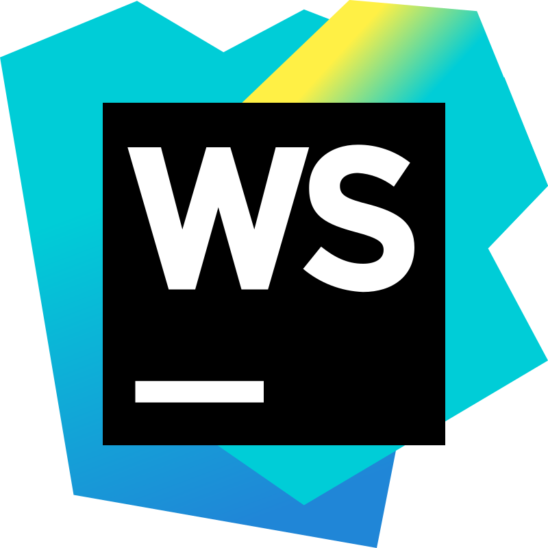

  

**About me**

- 💼 more than 4 years of manual testing experience and 2 year of automation testing experience.
- ⚡ further development in automation testing.
- 🌱 I’m currently learning Python and JS language and automation in it.

 

### 🤝 Contact me on:

  

  
  

 

## 🌱 Currently learning

- 📌 Python and JS language and automation in it
 

## 💼 Technical Skills

  <code></code>
  <code></code>
  <code></code>
  <code></code>
  <code></code>
  <code></code>
  <code></code>
  <code></code>
  <code></code>
  <code></code>
  <code></code>
  <code></code>
  <code></code>
  <code></code>
  <code></code>
  <code></code>
  <code></code>
  <code></code>
  <code></code>
  <code></code>
  <code></code>
  <code></code>
  <code></code>
  <code></code>
  <code></code>

 

### Tools

 

## 📈 GitHub Stats 

