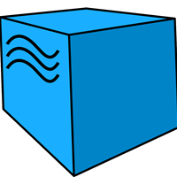

  

**About me**

- 💼 more than 4 years of manual testing experience
- 📋 did a course on test automation by QAGuru( Python + Selene)
- ⚡ further development in automation testing.
 

### 🤝 Contact me on:

  

  
  

 

## 🌱 Currently learning

- 📌 Python language and automation in it
 

## 💼 Technical Skills

  <code></code>
  <code></code>
  <code></code>
  <code></code>
  <code></code>
  <code></code>
  <code></code>
  <code></code>
  <code></code>
  <code></code>
  <code></code>
  <code></code>
  <code></code>
  <code></code>
  <code></code>
  <code></code>
  <code></code>

 

### Tools

 

## 📈 GitHub Stats 

